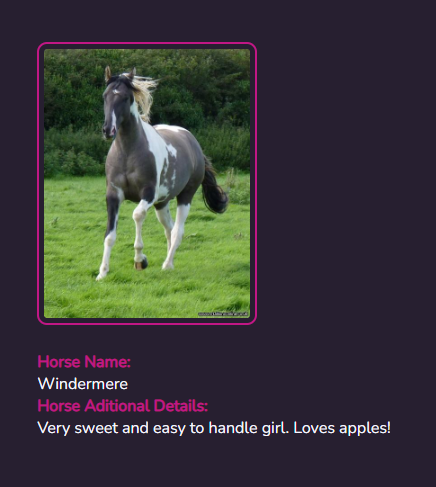

# AdaJOBS

Tercer trabajo práctico del curso de frontend de Ada. 

Con éste proyecto pusimos en práctica lo aprendido en el consumo de APIs, utilizando como método el fetch y las peticiones GET, POST, PUT y DELETE. Las últimas dos se encuentran deshabilitadas para que no me borren mis hermosos caballos y sus historias je.

Como tecnologías utilizamos HTML, Sass y Javascript. 

Pueden visitar el deploy [aquí](https://blackmistbasset.github.io/AdaJOBS/)

Saludos! ♥
